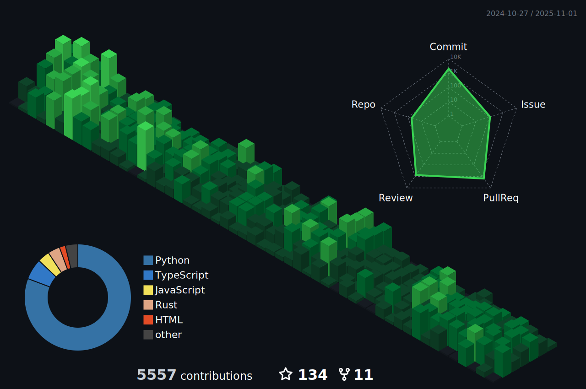

## 👋 hello, I'm nate

oss maintainer and maker of tools @ [prefect](https://github.com/prefecthq/prefect)

### i am likely to be focusing on:
- presenting ai with data to make better choices
- building / maintaining python / LLM dev tools that do this: [`prefect`](https://github.com/PrefectHQ/prefect), [`fastmcp`](https://github.com/jlowin/fastmcp), or [`marvin`](https://github.com/prefecthq/marvin)
- responding to issues, questions, discussions, review comments, aggressive reddit or hn comments
- keyboard shortcuts
- [atproto](https://at-me.zzstoatzz.io)
- API design

  
my background

#### _Prefect_ (Present) - **Senior Software Engineer**
- Finding new and compelling ways to make use of our OSS offerings
- Channeling community feedback into all Prefect interfaces (API, SDK, MCP)
- Working with leadership to distill sane-default products from complex and varying enterprise user needs
- Proofing and maintaining [`fastmcp`](https://github.com/jlowin/fastmcp) (most popular python interface to MCP)
- Building AI-powered systems to automate toil-rich internal tasks
- [Pioneering use of PyO3](https://github.com/zzstoatzz/pmgfal/tree/main) to do CPU-bound work in rust

#### _Prefect_ (Oct 2021-Jun 2024) - **Software Engineer**
- Designed and implemented a Celery-replacing asynchronous task queue to Prefect open-source and Prefect Cloud
- Contributed to upstream and downstream open-source projects like [`pydantic`](https://github.com/pydantic/pydantic) and [`chromadb`](https://github.com/chroma-core/chromadb)
- [Brought AI into Prefect Cloud](https://www.prefect.io/blog/introducing-error-summaries)
- Designed, implemented and managed open-source autonomous systems like our [slackbot](https://github.com/PrefectHQ/marvin/tree/main/examples/slackbot)

#### _SLATE_ (acq by Prefect, Oct 2021) - **Data Engineer**
- Built custom IaC, ETL, and data modeling for customers (dbt, snowflake, databricks, duckdb, prefect, etc)
- Translated business logic from leaders into maintainable / transparent data pipelines
- Implemented supporting web-apps for customers to interact with their data

---

### education
- **University of Michigan - Ann Arbor**
  - **Major**: Chemical Engineering
  - **Minor**: Physics
  - **Alumnus**: August 2020

  
github stats

 

---

---

[detailed contribution breakdown](./contribution.md)

